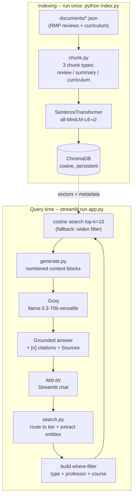

# The Unofficial Guide — Project 1

A Retrieval-Augmented Generation (RAG) system that answers questions about
University of Colorado Boulder Data Science professors and the MS-DS curriculum,
grounded in student reviews (RateMyProfessors) and official curriculum pages.

## Architecture



**Stages:** Document ingestion (`documents/*.json`) → Chunking (`chunk.py`) →
Embedding + vector store (`sentence-transformers` + `ChromaDB`, via `index.py`) →
Retrieval (`search.py`) → Generation (`generate.py` + Groq) → Interface (`app.py`).

## Quickstart

```bash
pip install -r requirements.txt          # install dependencies
# Add your Groq API key to ../.env  ->  GROQ_API_KEY=gsk_...
python index.py                          # build the ChromaDB vector index
streamlit run app.py                     # launch the chat UI
# or, from the command line:
python search.py "Is CSCI 5502 a hard course?"     # retrieval only
python generate.py "What do students say about Al Pisano?"   # full RAG answer
```

---

## Domain

Student reviews of Data Science faculty at CU Boulder, combined with the official
MS-DS curriculum. This knowledge is valuable because official course catalogs
describe *what* a course covers but never *how* it is actually taught — teaching
style, exam difficulty, grading fairness, and workload. That candid signal is
scattered across RateMyProfessors and is hard to assess before enrolling. The
system lets a prospective student make an informed decision about whether and how
to take a course.

The system targets five questions:
- How well does a professor teach?
- What should a student keep in mind for a course a given professor leads?
- How hard are the exams, grading, and course structure?
- What are the specific negatives of a professor's teaching style?
- Which courses does a professor handle?

---

## Document Sources

19 sources: 12 professor review pages (RateMyProfessors) and 7 official MS-DS
curriculum pages.

| # | Source | Type | URL or file path |
|---|--------|------|-----------------|
| 1 | Alfonso Bastias — RMP reviews | Review | `documents/alfonso-bastias.json` / https://www.ratemyprofessors.com/professor/3126234 |
| 2 | Jem Corcoran — RMP reviews | Review | `documents/jem-corcoran.json` / https://www.ratemyprofessors.com/professor/715635 |
| 3 | Brian Zaharatos — RMP reviews | Review | `documents/brian-zaharatos.json` / https://www.ratemyprofessors.com/professor/2095791 |
| 4 | Geena Kim — RMP reviews | Review | `documents/geena-kim.json` / https://www.ratemyprofessors.com/professor/2509139 |
| 5 | Ioana Fleming — RMP reviews | Review | `documents/ioana-fleming.json` / https://www.ratemyprofessors.com/professor/2418518 |
| 6 | Al Pisano — RMP reviews | Review | `documents/al-pisano.json` / https://www.ratemyprofessors.com/professor/2853146 |
| 7 | Sriram Sankarnarayanan — RMP reviews | Review | `documents/sriram-sankarnarayanan.json` / https://www.ratemyprofessors.com/professor/1648665 |
| 8 | Qin Lv — RMP reviews | Review | `documents/qin-lv.json` / https://www.ratemyprofessors.com/professor/1923840 |
| 9 | William Kuskin — RMP reviews | Review | `documents/william-kuskin.json` / https://www.ratemyprofessors.com/professor/1089963 |
| 10 | Osita Onyejekwe — RMP reviews | Review | `documents/osita-onyejekwe.json` / https://www.ratemyprofessors.com/professor/2450568 |
| 11 | Alan Paradise — RMP reviews | Review | `documents/alan-paradise.json` / https://www.ratemyprofessors.com/professor/2482275 |
| 12 | Christopher Vargo — RMP reviews | Review | `documents/christopher-vargo.json` / https://www.ratemyprofessors.com/professor/2449820 |
| 13 | MS-DS Curriculum Overview | Curriculum | `documents/curriculum_msds.json` / https://www.colorado.edu/program/data-science/campus/curriculum |
| 14 | MS-DS — Bridge Courses | Curriculum | `documents/curriculum_bridge_courses.json` / .../curriculum/Bridge-Courses |
| 15 | MS-DS — Statistics | Curriculum | `documents/curriculum_statistics.json` / .../curriculum/statistics |
| 16 | MS-DS — Computer Science | Curriculum | `documents/curriculum_computer_science.json` / .../curriculum/computer-science |
| 17 | MS-DS — General Data Science | Curriculum | `documents/curriculum_general_ds.json` / .../curriculum/general-data-science |
| 18 | MS-DS — Other Core Courses | Curriculum | `documents/curriculum_other_core.json` / .../curriculum/other-core-courses |
| 19 | MS-DS — Data Science Electives | Curriculum | `documents/curriculum_ds_electives.json` / .../curriculum/data-science-electives |

---

## Chunking Strategy

The corpus has two structurally different document types, so `chunk.py` uses two
strategies and produces three chunk types.

**Type A — Reviews (document-level chunking with metadata injection):**
- **Chunk size:** one whole review per chunk (RMP reviews average ~70 tokens).
- **Overlap:** none — each review is already self-contained.
- **Why:** splitting a ~70-token review would slice sentiment like "tough but
  fair" across boundaries and destroy meaning. Each review's text is prefixed
  with `Professor: <name> | Department: <dept> | Course: <code>` before
  embedding, so a raw comment like "Horrible teacher" still matches a query that
  names the professor.

**Tier 2 — Professor summaries:** one synthesized chunk per professor,
aggregating average quality/difficulty, percent-would-take-again, common tags,
and top-voted excerpts. This supports aggregate/comparison queries that no single
review can answer.

**Type B — Curriculum pages (fixed-size with sentence-boundary snapping):**
- **Chunk size:** 500 characters.
- **Overlap:** 100 characters.
- **Method:** `RecursiveCharacterTextSplitter` with separators
  `["\n\n", "\n", ". ", " ", ""]` so it prefers paragraph/sentence boundaries
  before falling back to word/character splits.
- **Why:** curriculum pages mix structured lists (course codes, credits) with
  prose; overlapping fixed-size chunks preserve enough context per hit.
- **Two refinements (added after retrieval testing):** (1) navigation/footer
  boilerplate (site menus, "Apply Now", elective-request form templates) is
  filtered out so it cannot crowd out real course content; (2) each curriculum
  page also emits one synthesized **course-index chunk** — a compact `CODE: Name`
  list of every course on that page — which embeds far better for "list all
  MS-DS courses" style queries than prose chunks where course codes are buried.

**Preprocessing:** JSON is parsed per file; whitespace is normalized; malformed
or unreadable files are skipped with a warning rather than aborting the run; and
chunk IDs are de-duplicated across the whole corpus.

**Final chunk count:** 335 chunks across all 19 documents.

---

## Embedding Model

**Model used:** `sentence-transformers/all-MiniLM-L6-v2` (384-dimensional),
running locally — no API key, no rate limits, no per-call cost. Vectors are
stored in a local **ChromaDB** persistent collection using **cosine** distance
(`hnsw:space: cosine`). Retrieval returns the top **k = 10** chunks (raised from
an initial k = 5 so list-style curriculum questions receive enough chunks to
cover content spread across the seven curriculum pages).

**Production tradeoff reflection:** `all-MiniLM-L6-v2` is fast and free, but it
is English-only and caps at ~256 tokens — fine for short reviews, limiting for
long curriculum prose. If cost were not a constraint I would weigh a
larger-context, higher-accuracy model (e.g. OpenAI `text-embedding-3-large` or a
domain-tuned model). Tradeoffs: longer context length captures more of each
curriculum page per chunk; better accuracy on domain-specific jargon (course
codes, professor nicknames) improves recall; multilingual support would matter
only if reviews weren't English; the cost is added latency and API dependency
versus the current zero-cost local inference.

---

## Grounded Generation

Generation runs on **Groq** (`llama-3.3-70b-versatile`, `temperature=0.2`,
streamed) via `generate.py`.

**System prompt grounding instruction** (from `SYSTEM_PROMPT` in `generate.py`):
- "Answer ONLY using the information in the provided context blocks."
- "Cite the sources you use with their bracketed number, e.g. [1] or [2]."
- "If the context does not contain enough information to answer, say *I don't
  have enough information to answer that based on the available reviews and
  curriculum data.* Do not invent professors, courses, ratings, or facts."
- "When summarizing student opinions, make clear they are student reviews, not
  objective fact."

**Structural grounding choices:**
- Retrieval uses **pre-filtered hybrid search** (`search.py`): the query is
  routed to a chunk tier (review / summary / curriculum) by a **semantic
  router** (see "Query Routing" below), named entities (professor, course code)
  are extracted and applied as hard metadata filters, and cosine search runs
  only within that subset. When routing confidence is low or a filter returns
  nothing, the search pools candidates from all tiers and re-ranks them.
- Retrieved chunks are formatted as **numbered, attributed context blocks**
  (`[1] (review) Al Pisano — CSCI 1000 — RateMyProfessors <url>`), so the model's
  `[n]` citations map directly to real sources.

**How source attribution is surfaced:** the model emits inline `[n]` citations;
the Streamlit UI shows a collapsible **"Sources"** expander listing each
retrieved chunk's attribution, similarity score (`1 − cosine distance`), and a
text preview; the CLI prints the same source list.

---

## Evaluation Report

Results below are actual system responses (Groq `llama-3.3-70b-versatile`, top-k = 5)
**after** adopting the hybrid semantic router (Option 6 — see "Query Routing").
The "tier (was)" column shows how routing changed from the original keyword router.

> **Note (later improvement):** these results were recorded at top-k = 5 and
> before the curriculum-chunking refinements (navigation-boilerplate filter +
> synthesized course-index chunks). With those changes and top-k = 10, the
> retrieval gaps behind Q1 ("required courses") and Q5 ("electives") are largely
> resolved — a "list all MS-DS courses" query now returns the actual course
> listings instead of structural/navigation text. The table is kept as the
> original measured run for an honest before/after record.

| # | Question | Routed tier (was) | System response (summarized) | Retrieval quality | Response accuracy |
|---|----------|-------------------|------------------------------|-------------------|-------------------|
| 1 | What courses are required for the MS-DS degree? | curriculum (curriculum) | Gave the 21+9 credit structure and named some STAT courses, but not a complete list | Relevant (curriculum) | Partially accurate |
| 2 | Is CSCI 5502 Data Mining considered a hard course? | review (was curriculum) | Now searches reviews; honestly reports the corpus has reviews for CSCI 4502/1000 but no CSCI 5502 | Relevant tier, but corpus lacks the data | Partially accurate (honest no-data) |
| 3 | Which Data Science professor has the highest overall rating? | summary (was review) | Now retrieves professor summary chunks (with ratings) but still hedges — top-5 summaries don't guarantee the global maximum | Relevant (summary) | Partially accurate |
| 4 | What do students say about grading fairness in statistics courses? | review (was curriculum) | Detailed, cited answer: inconsistent grading for Bastias [1] and Qin Lv ("playing darts for your grade") [2,4,5] | Relevant (review) | Accurate |
| 5 | What elective courses are available in the MS-DS program? | curriculum (curriculum) | Pointed to the Data Science Electives page and the elective-review process | Relevant (curriculum) | Partially accurate |

**Retrieval quality:** Relevant / Partially relevant / Off-target
**Response accuracy:** Accurate / Partially accurate / Inaccurate

**Before vs. after the router change:** the original keyword router mis-routed
Q2, Q3, and Q4 (all "Inaccurate / no answer"). With the semantic router, all
five questions now route to the correct tier. Q4 improved from a non-answer to a
fully cited, accurate answer. Q2 and Q3 now search the *right* tier but surface
deeper, honest limitations (corpus data coverage for Q2; top-k vs. global ranking
for Q3) rather than a routing bug. The grounding guard continues to behave well:
the model refuses or hedges instead of fabricating.

---

## Failure Case Analysis

**Question that failed:** "Which Data Science professor has the highest overall
rating?" (and, for the same root cause, Q2 and Q4).

**What the system returned:** "I don't have enough information to answer that
based on the available reviews and curriculum data." The retrieved chunks were
individual `review` chunks, none of which contain cross-professor rating
comparisons.

**Root cause (tied to a specific pipeline stage):** the **query-routing** stage
in `search.py` originally used brittle exact-substring keyword matching.
`route_query` checked `AGGREGATE_SIGNALS` such as `"which professor"` and
`"highest rating"`. In this query the trigger phrases are broken up — "which
**Data Science** professor" is not the substring "which professor", and "highest
**overall** rating" is not the substring "highest rating". With no signal
matched, the query defaulted to the `review` tier instead of the `summary` tier,
so the aggregated per-professor summary chunks (which hold the average ratings)
were never retrieved. Q2 and Q4 failed the mirror-image way: the word
"course"/"courses" matched `CURRICULUM_SIGNALS` first, so review-style questions
got routed to the curriculum tier.

**What I changed to fix it:** I replaced the keyword router with a **hybrid
semantic router** (Option 6 below). See the "Query Routing" section for the
options considered, the implementation, and the measured before/after results.
After the change, all five evaluation questions route to the correct tier.

---

## Query Routing

### Approaches considered

| # | Approach | Pros | Cons |
|---|----------|------|------|
| 1 | Patch keyword router (fix ordering + word-level matching) | Tiny change; no new deps; fast; deterministic; zero cost | Still brittle to unseen phrasings; manual keyword upkeep; mixed-intent conflicts stay heuristic |
| 2 | Weighted scoring router (sum signal weights, pick top tier) | Removes first-match order bug; local, cheap, deterministic; better on mixed queries | Weight tuning is fiddly; still keyword-dependent; needs test cases to tune |
| 3 | Embedding semantic router (cosine vs per-tier anchor examples) | Reuses the loaded `all-MiniLM` model — no new dep, no API cost; generalizes to paraphrases; no keyword upkeep | Needs curated anchor examples; threshold tuning; less interpretable on misroutes |
| 4 | LLM zero-shot classifier (Groq) | Most robust to phrasing/nuance; easily extended via prompt; can report confidence | Extra API round-trip (latency + cost + network); nondeterministic; another failure point; overkill for 3 classes |
| 5 | No hard routing — query all tiers and merge/re-rank | Eliminates routing as a single point of failure; aggregate queries always reach summary chunks | ~3x retrieval calls; needs cross-tier score normalization; summary chunks can crowd out reviews |
| 6 | **Hybrid: confident fast-path + multi-tier fallback (chosen)** | Fast/cheap on the common case, robust on the hard case; no new deps; degrades gracefully | Two mechanisms to maintain; more code paths to test |

### Implementation (router + retrieval changes in `search.py`)

The chosen Option 6 is implemented in `search.py` and configured in `config.py`:

- **Anchors + threshold (`config.py`):** `TIER_EXAMPLES` holds a handful of
  example queries per tier, and `ROUTER_CONFIDENCE_THRESHOLD` (0.35) is the
  cutoff for trusting the fast-path.
- **Semantic router (`route_query_semantic`):** the query embedding is compared
  by cosine similarity to each tier's anchor embeddings (cached once via the
  shared model); the best tier and its similarity (confidence) are returned.
  `routing_decision(query)` is a convenience wrapper used by the CLI display.
- **Confident fast-path (`search`):** if confidence ≥ threshold, apply a hard
  pre-filter on the routed tier (plus professor/course entity filters via
  `build_where`), trying tier+entity then tier-only.
- **Multi-tier fallback (`_multi_tier_query`):** if confidence is low, or the
  confident filter matched nothing, pool the top candidates from every tier and
  globally re-rank by cosine distance (valid because the whole collection shares
  one cosine space). This guarantees summary chunks are always candidates.
- **Last resort:** an unfiltered full-collection search.
- The legacy keyword `route_query` is retained for reference/back-compat but is
  no longer used for routing.

### Why Option 6 is best (after testing)

Measured routing on the five evaluation questions (confidence in parentheses):

| Question | Old keyword tier | New semantic tier (confidence) | Outcome |
|----------|------------------|--------------------------------|---------|
| Q1 required courses | curriculum | curriculum (1.00) | correct (unchanged) |
| Q2 CSCI 5502 hard? | curriculum | review (0.56) | fixed routing — now searches reviews |
| Q3 highest overall rating | review | summary (0.81) | fixed routing — now retrieves summaries |
| Q4 grading fairness | curriculum | review (0.63) | fixed — non-answer → accurate cited answer |
| Q5 electives | curriculum | curriculum (0.86) | correct (unchanged) |

All five now route correctly, with every confidence comfortably above the 0.35
threshold (so the cheap fast-path handles every eval query and the multi-tier
fallback only engages on genuinely ambiguous inputs). Option 6 beat the
alternatives in practice because:

- The embedding router (the core of Option 6) fixed the brittleness of Options
  1–2 without their endless keyword upkeep, and it generalized to the exact
  paraphrases ("Data Science professor", "overall rating") that broke the keyword
  matcher — at **zero added dependency or API cost**, since the embedding model
  is already loaded.
- The multi-tier fallback gives Option 5's robustness as a safety net without
  paying its ~3x retrieval cost on every query.
- It avoids Option 4's per-query LLM latency, cost, and nondeterminism.

Honest limitations the fix exposed (now *not* routing bugs): Q2 returns a
truthful "no data" because the corpus has no CSCI 5502 reviews, and Q3 still
hedges because top-k retrieved summaries don't guarantee the global highest
rating (even at k = 10, nearest-neighbor retrieval needn't surface the single
maximum across all 12 professors) — a ranking/aggregation limitation that would
need a dedicated "rank all summaries" path rather than nearest-neighbor retrieval.

---

## Spec Reflection

**One way the spec helped you during implementation:** `planning_raw.md` defined
the two-tier indexing architecture and the pre-filtered hybrid search strategy up
front, including the `route_query` signals and metadata schema. That made the
`chunk.py` / `index.py` / `search.py` interfaces fall out cleanly — chunks carry
exactly the metadata fields (`type`, `professor_name`, `course_code`) the search
filters need, so the generation layer could be added on top without reworking
retrieval.

**One way your implementation diverged from the spec, and why:** the spec
described Groq loosely as the "grok llm." The actual project is wired for **Groq**
(the `groq` SDK and a `gsk_` key), so the generation layer targets Groq's hosted
`llama-3.3-70b-versatile` rather than xAI's Grok. The implementation also added
defensive error handling not called out in the plan (idempotent re-indexing with
duplicate-ID validation in `index.py`, graceful per-document skips in `chunk.py`)
after observing real failure modes during testing.

---

## AI Usage

**Instance 1**

- *What I gave the AI:* the `planning_raw.md` generation/interface milestone plus
  the existing `search.py` retrieval interface, and asked it to build the
  generation layer and a Streamlit chat UI.
- *What it produced:* `generate.py` (context formatting, a grounding system
  prompt, streamed Groq calls, a CLI) and `app.py` (a Streamlit chat with history
  and a Sources expander), plus a `GROQ_MODEL` config entry.
- *What I changed or overrode:* confirmed Groq (not xAI Grok) as the provider
  based on the `gsk_` key and `groq` dependency; kept retrieval running per turn
  while passing recent history to the model for coherence.

**Instance 2**

- *What I gave the AI:* `index.py` and a request to analyze its failure scenarios
  and add safety nets.
- *What it produced:* a list of failure modes (empty chunk list, missing
  dependencies, model-load/network failure, unwritable DB path, duplicate IDs,
  out-of-memory, partial indexing) and a hardened `index.py` returning proper
  exit codes with targeted error handling.
- *What I changed or overrode:* during end-to-end testing I directed fixes for
  real environment issues the AI surfaced — pinning `safetensors==0.4.3` for the
  installed torch 2.1, upgrading `chromadb` to satisfy `requirements.txt`, and
  adding UTF-8 stdout reconfiguration so the CLI prints correctly on Windows.
