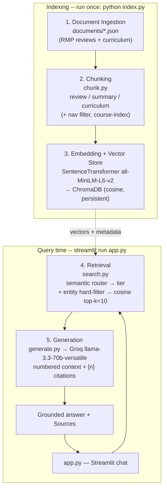

# Project 1 Planning: The Unofficial Guide

## Domain

<!-- What domain did you choose? Why is this knowledge valuable and hard to find through official channels? --> I chose Student Reviews of Data Science faculty members at University of Colorado Boulder. The key reason to choose this is that it is hard to find candid reviews about how well the professor teaches, before the session or semester starts, and it makes us take informed decisions as to how we could better navigate the course and use other resources to study or not take the course at all. 
> Following are the 5 questons the system will answer or handle:
     - How well does the professor teach?
     - What are few things to keep in mind if a student is taking a course that a particular professor is in-charge?
     - How easy or difficult is the exam style, grading and course structure?
     - What are specific the negatives of a particular professor's teaching style?
     - What courses a particular professor handles?
---

## Documents

<!-- List your specific sources: URLs, subreddit names, forum threads, or file descriptions.
     Aim for at least 10 sources that together cover different subtopics or perspectives within your domain. -->

| # | Source | Description | URL or location |
|---|--------|-------------|-----------------|
| 1 | Alfonso Bastias — RMP reviews | Student ratings & comments covering teaching style and course difficulty | `documents/alfonso-bastias.json` / https://www.ratemyprofessors.com/professor/3126234 |
| 2 | Jem Corcoran — RMP reviews | Reviews for probability and statistics courses | `documents/jem-corcoran.json` / https://www.ratemyprofessors.com/professor/715635 |
| 3 | Brian Zaharatos — RMP reviews | Reviews for applied math and data science courses | `documents/brian-zaharatos.json` / https://www.ratemyprofessors.com/professor/2095791 |
| 4 | Geena Kim — RMP reviews | Reviews covering teaching style and workload expectations | `documents/geena-kim.json` / https://www.ratemyprofessors.com/professor/2509139 |
| 5 | Ioana Fleming — RMP reviews | Reviews for algorithms and theory courses | `documents/ioana-fleming.json` / https://www.ratemyprofessors.com/professor/2418518 |
| 6 | Al Pisano — RMP reviews | Reviews covering course difficulty and exam style | `documents/al-pisano.json` / https://www.ratemyprofessors.com/professor/2853146 |
| 7 | Sriram Sankarnarayanan — RMP reviews | Reviews for formal methods and verification courses | `documents/sriram-sankarnarayanan.json` / https://www.ratemyprofessors.com/professor/1648665 |
| 8 | Qin Lv — RMP reviews | Reviews for systems and networking courses | `documents/qin-lv.json` / https://www.ratemyprofessors.com/professor/1923840 |
| 9 | William Kuskin — RMP reviews | Reviews for writing-intensive data science courses | `documents/william-kuskin.json` / https://www.ratemyprofessors.com/professor/1089963 |
| 10 | Osita Onyejekwe — RMP reviews | Reviews covering grading style and course structure | `documents/osita-onyejekwe.json` / https://www.ratemyprofessors.com/professor/2450568 |
| 11 | Alan Paradise — RMP reviews | Reviews covering lecture quality and office hours | `documents/alan-paradise.json` / https://www.ratemyprofessors.com/professor/2482275 |
| 12 | Christopher Vargo — RMP reviews | Reviews for data journalism and media analytics courses | `documents/christopher-vargo.json` / https://www.ratemyprofessors.com/professor/2449820 |
| 13 | CU Boulder MS-DS Curriculum Overview | Full curriculum overview page listing degree requirements | `documents/curriculum_msds.json` / https://www.colorado.edu/program/data-science/campus/curriculum |
| 14 | MS-DS Curriculum — Bridge Courses | Descriptions of bridge/prerequisite courses for the MS-DS program | `documents/curriculum_bridge_courses.json` / https://www.colorado.edu/program/data-science/campus/curriculum/Bridge-Courses |
| 15 | MS-DS Curriculum — Statistics | Statistics course offerings and descriptions in the MS-DS program | `documents/curriculum_statistics.json` / https://www.colorado.edu/program/data-science/campus/curriculum/statistics |
| 16 | MS-DS Curriculum — Computer Science | CS course offerings and descriptions in the MS-DS program | `documents/curriculum_computer_science.json` / https://www.colorado.edu/program/data-science/campus/curriculum/computer-science |
| 17 | MS-DS Curriculum — General Data Science | Core data science course offerings and descriptions | `documents/curriculum_general_ds.json` / https://www.colorado.edu/program/data-science/campus/curriculum/general-data-science |
| 18 | MS-DS Curriculum — Other Core Courses | Other required core courses outside statistics and CS | `documents/curriculum_other_core.json` / https://www.colorado.edu/program/data-science/campus/curriculum/other-core-courses |
| 19 | MS-DS Curriculum — Data Science Electives | Elective course offerings and descriptions for the MS-DS program | `documents/curriculum_ds_electives.json` / https://www.colorado.edu/program/data-science/campus/curriculum/data-science-electives |

---

## Chunking Strategy

<!-- How will you split documents into chunks?
     State your chunk size (in tokens or characters), overlap size, and explain why those
     numbers fit the structure of your documents.
     A review-heavy corpus warrants different chunking than a long FAQ. -->
> Professors-txt files
### Type A : Review-as-a-chunk/ Document-level chunking with Metadata injections : 

**Chunk size:**
RMP reviews average ~70 tokens. The entire review is one whole chunk and is concatenated with relevant metadata fields into the text of a chunk before computing its embedding vector. The "embedding target" is the final string that gets passed to the embedding model.

**Overlap:**
Overlap = None — each review is already self-contained.

**Reasoning:**
RMP reviews average ~70 tokens. Splitting them with a character splitter would slice "He's tough but fair" into "He's tough" + "but fair" destroying the exact sentiment. The aim is to capture the whole sentiment so as to not provide factually incorrect responses. Why metadata injection matters can be understood by the following example: 
When we embed a raw review like:

"Horrible teacher"

...the embedding model has no idea who the review is about or which course it refers to. If a user queries "Is Geena Kim a good professor?", the embedding of that query won't have strong semantic similarity to "Horrible teacher" alone because there's no mention of the professor's name in the chunk.

Risk to test: With ~70-token reviews, the metadata prefix can be 30–40% of the total string. This may flatten semantic distances between reviews. The evaluation section includes an A/B test: raw review text vs. metadata-injected string, measuring which produces better retrieval.

### Type B: Curriculum Pages:

**Strategy: Fixed-size with sentence-boundary snapping**

**Chunk size:** 500 characters
**Overlap:** 100 characters

**Rationale:** Curriculum pages contain structured lists (course codes, credit hours, requirements) interspersed with prose. Fixed-size chunks with overlap preserve enough context for a retrieval hit to be useful. Sentence-boundary snapping (break at the last `.` within the final 30% of the chunk) prevents mid-sentence cuts.

> **Implementation note (added after testing):** two refinements were made to the
> curriculum chunker after observing real retrieval failures (see *Anticipated
> Challenges* #3). First, navigation/footer boilerplate (site menus, "Apply Now",
> elective-request form templates) is filtered out so it cannot crowd out real
> course content. Second, each curriculum page also emits one synthesized
> **course-index chunk** — a compact `CODE: Name` list of every course on that
> page — which embeds far better for "list all MS-DS courses" style queries than
> the prose chunks where course codes are buried.

---

## Two-Tier Indexing Architecture

### Why two tiers?
A flat index of review-level chunks answers questions like "what did students say about Smith's grading?" but fails on aggregate questions like "which CS professor gives the most useful feedback?" — which require scanning *across* all reviews for all professors.

### Tier 1: Review-level chunks
One chunk per individual review. Used for specific, named-professor queries.

```python
{
    "id": "uuid-v4",
    "text": "Professor: John Smith | Course: CSCI 5502 | Review: ...",
    "metadata": {
        "type": "review",
        "professor_name": "John Smith",
        "course_code": "CSCI 5502",
        "difficulty": 4.0,
        "quality_rating": 5.0,
        "grade_received": "A-",
        "parent_id": "prof_john_smith_summary"
    }
}
```

### Tier 2: Professor-summary chunks
One synthesized chunk per professor, aggregated from all their reviews. Used for comparison and recommendation queries.

```python
{
    "id": "prof_john_smith_summary",
    "text": "Professor John Smith — average quality 4.8/5, average difficulty 3.2/5, based on 42 reviews. Common themes: ...[review excerpts]...",
    "metadata": {
        "type": "summary",
        "professor_name": "John Smith",
        "department": "Computer Science",
        "review_count": 42,
        "avg_quality": 4.8,
        "avg_difficulty": 3.2
    }
}
```

### Query routing between tiers

The plan below started from a keyword router. It was **replaced during
implementation** with a semantic router (see *Search Architecture* and the
README's "Query Routing" section) after the keyword version mis-routed several
evaluation questions. The keyword router is kept for reference/back-compat.

```python
AGGREGATE_SIGNALS = ["which professor", "best", "easiest", "hardest",
                     "most", "compare", "recommend", "who should I take"]

def route_query(query: str) -> str:
    """Returns 'summary' or 'review' tier based on query intent."""
    if any(signal in query.lower() for signal in AGGREGATE_SIGNALS):
        return "summary"
    return "review"
```

---
## Retrieval Approach

<!-- Which embedding model are you using (e.g., all-MiniLM-L6-v2 via sentence-transformers)?
     How many chunks will you retrieve per query (top-k)?
     If you were deploying this for real users and cost wasn't a constraint, what tradeoffs
     would you weigh in choosing a different embedding model — context length, multilingual
     support, accuracy on domain-specific text, latency? -->


**Embedding model:** `sentence-transformers/all-MiniLM-L6-v2`
- Runs locally — no API key, no rate limits, no cost
- 384-dimensional output
- Strong on short semantic text (well-suited for reviews)

**Vector database:** ChromaDB (local)
- No server setup required
- Supports metadata filtering natively via `where={}` clauses
- Stores text, embeddings, and metadata in one record

**Top-k:**
Top 10 chunks. (Originally planned at 5; raised to 10 during testing so
list-style curriculum questions — e.g. "list all MS-DS courses" — receive enough
chunks to cover content spread across the seven curriculum pages.)

**Production tradeoffs (documented for README):**

| Factor | all-MiniLM-L6-v2 | Production alternative (e.g. OpenAI `text-embedding-3-large`) |
|---|---|---|
| Cost | Free (runs locally) | Paid per-token API billing |
| Speed | Fast locally; no network round-trip | Network latency per call, but high server-side throughput |
| Multilingual | English-only | Strong multilingual coverage (useful if reviews weren't all English) |
| Context length | 256 tokens max | ~8191 tokens — fits long curriculum prose in a single chunk |
| Domain accuracy | Good on short reviews | Higher accuracy on jargon (course codes, professor nicknames) → better recall |

If cost were not a constraint, the main wins from a larger model would be longer
context length (fewer, richer curriculum chunks) and higher accuracy on
domain-specific text; the cost is added latency and an external API dependency
versus the current zero-cost local inference.

---
## Search Architecture

**Strategy: Pre-filtered hybrid vector search with a semantic router**

Step 0 — **Route to a tier**: a semantic router embeds the query and compares it
(cosine) to a few anchor examples per tier (`review` / `summary` / `curriculum`),
returning the best tier plus a confidence score.

Step 1 — **Hard filter** (when query names a professor or course): Apply exact metadata match first to isolate the relevant subset.

Step 2 — **Semantic search**: Run cosine similarity only against the filtered subset.

**Why this order matters:** Running semantic search across all professors and then filtering would surface semantically similar reviews from the *wrong* professor. Pre-filtering eliminates cross-contamination before the semantic step runs.

**Fallback:** When routing confidence is low, or a filter returns no hits, pool
the top candidates from every tier and globally re-rank by cosine distance (the
whole collection shares one cosine space). A final unfiltered full-collection
search is the last resort. This guarantees aggregate questions can always reach
the summary tier.

> **Why the router changed:** the originally planned keyword router used brittle
> exact-substring matching ("which professor", "highest rating") and mis-routed
> queries whose trigger phrases were broken up ("which **Data Science**
> professor", "highest **overall** rating"). Replacing it with the semantic
> router fixed routing on all five evaluation questions at zero added dependency
> or API cost, since the embedding model is already loaded. Full
> approach-comparison and before/after numbers live in the README.

---

## Evaluation Plan

<!-- List your 5 test questions with their expected correct answers.
     Questions should be specific enough that you can judge whether the system's response
     is right or wrong. "What are good dining halls?" is too vague.
     "What do students say about wait times at [dining hall name] during lunch?" is testable. -->
Following are the 5 questons the system will answer or handle:
     - How well does the professor teach?
     - What are few things to keep in mind if a student is taking a course that a particular professor is in-charge?
     - How easy or difficult is the exam style, grading and course structure?
     - What are specific the negatives of a particular professor's teaching style?
     - What courses a particular professor handles?

Ragas: An open-source framework specifically designed to evaluate RAG architectures on Context Precision, Recall, Faithfulness, and Answer Relevance.

**5 test questions with ground truth:**

| # | Question | Type | Expected answer source |
|---|---|---|---|
| 1 | What courses are required for the MS-DS degree? | Factual | Curriculum page |
| 2 | Is CSCI 5502 Data Mining considered a hard course? | Specific | Review-level chunks |
| 3 | Which Data Science professor has the highest overall rating? | Aggregate | Summary-level chunks |
| 4 | What do students say about grading fairness in statistics courses? | Thematic | Review-level chunks |
| 5 | What elective courses are available in the MS-DS program? | Factual | Electives curriculum page |

**Evaluation rubric per question:**
- Retrieved chunks: relevant / partially relevant / irrelevant
- Response accuracy: correct / partially correct / incorrect
- Source citation: present and accurate / missing / wrong

**Planned failure case to document:**
Question 3 (aggregate ranking) run against Tier 1 (review-level) only — expected to fail because no single review chunk contains cross-professor comparison information. This tests whether tier routing is working and demonstrates the value of the summary tier.

**A/B test for evaluation report:**
Run Question 2 with (A) raw review text embedded and (B) metadata-injected string embedded. Compare retrieval hit quality and document findings.

---

## Anticipated Challenges

<!-- What could go wrong? Name at least two specific risks with reasoning.
     Consider: noisy or inconsistent documents, missing source attribution, off-topic
     retrieval, chunks that split key information across boundaries. -->

1. **Metadata injection flattening semantic distance.** Because each ~70-token
   review is prefixed with `Professor | Department | Course` metadata, that
   prefix can be 30–40% of the embedded string. Identical prefixes across many
   reviews risk pulling their embeddings closer together and washing out the
   sentiment signal, hurting discrimination between reviews. *Mitigation:* keep
   the prefix minimal (three fields), and A/B test raw vs. injected text.

2. **Aggregate questions failing on a review-only index.** Questions like "which
   professor has the highest rating?" need information that lives *across* all
   reviews, not in any single review chunk. A flat review index would retrieve
   plausible-looking but unrankable chunks. *Mitigation:* the two-tier design
   adds per-professor summary chunks, and the router sends aggregate intents to
   the summary tier.

3. **Curriculum course lists split / drowned out by boilerplate.** Curriculum
   pages mix dense course-code lists with navigation menus and form templates.
   Fixed-size splitting can cut a course list across chunk boundaries, and the
   boilerplate ("Apply Now", site menus, "Course name / Course number / …"
   templates) is semantically close to course queries, so it can outrank the
   real course content and push it past top-k. *(This risk materialized: "list
   all MS-DS courses" returned only structural/nav text.)* *Mitigation:* filter
   navigation/form chunks at chunk time and emit a synthesized per-page
   course-index chunk, then retrieve a larger top-k.

4. **Off-topic retrieval and hallucinated attribution.** Without grounding
   guards the LLM might answer from prior knowledge or cite the wrong source.
   *Mitigation:* a strict system prompt ("answer ONLY from context; cite `[n]`;
   refuse if insufficient") and numbered, attributed context blocks so every
   citation maps to a real retrieved chunk.

---

## Architecture

<!-- Draw a diagram of your pipeline showing the five stages:
     Document Ingestion → Chunking → Embedding + Vector Store → Retrieval → Generation
     Label each stage with the tool or library you're using.
     You can use ASCII art, a Mermaid diagram, or embed a sketch as an image.
     You'll use this diagram as context when prompting AI tools to implement each stage. -->



**Stages and tools:** Document ingestion (`documents/*.json`) → Chunking
(`chunk.py`) → Embedding + vector store (`sentence-transformers` + `ChromaDB`,
via `index.py`) → Retrieval (`search.py`) → Generation (`generate.py` + Groq),
surfaced through the Streamlit interface (`app.py`).

---

## AI Tool Plan

<!-- For each part of the pipeline below, describe:
     - Which AI tool you plan to use (Claude, Copilot, ChatGPT, etc.)
     - What you'll give it as input (which sections of this planning.md, which requirements)
     - What you expect it to produce
     - How you'll verify the output matches your spec

     "I'll use AI to help me code" is not a plan.
     "I'll give Claude my Chunking Strategy section and ask it to implement chunk_text()
     with my specified chunk size and overlap" is a plan. -->

**Milestone 3 — Ingestion and chunking:**
- *Tool:* Claude (in Cursor).
- *Input:* the *Documents* and *Chunking Strategy* sections of this plan, plus a
  sample `documents/*.json` file so the model sees the real schema.
- *Expected output:* `chunk.py` implementing `build_chunks()` with the two
  strategies — one-review-per-chunk with metadata injection (Type A) and the
  500/100 `RecursiveCharacterTextSplitter` for curriculum pages (Type B) — plus
  the per-professor summary chunk.
- *Verification:* run `python chunk.py` and confirm the per-type counts are
  sensible (review ≫ summary, summary = #professors), and spot-check that review
  chunks carry the planned metadata fields and curriculum chunks aren't cut
  mid-course-code.

**Milestone 4 — Embedding and retrieval:**
- *Tool:* Claude (in Cursor).
- *Input:* the *Retrieval Approach* and *Search Architecture* sections, plus the
  chunk schema from Milestone 3.
- *Expected output:* `index.py` (embed with `all-MiniLM-L6-v2`, upsert into a
  persistent ChromaDB cosine collection) and `search.py` (semantic router +
  entity extraction + `where` filter + cosine top-k with multi-tier fallback).
- *Verification:* run `python index.py` and confirm all chunks index without
  duplicate-ID errors; run `python search.py "<query>"` on the five evaluation
  questions and confirm each routes to the expected tier and returns relevant
  chunks.

**Milestone 5 — Generation and interface:**
- *Tool:* Claude (in Cursor).
- *Input:* the `search.py` retrieval interface plus the grounding requirements
  (answer only from context, `[n]` citations, refuse when insufficient).
- *Expected output:* `generate.py` (numbered/attributed context blocks, grounding
  system prompt, streamed Groq `llama-3.3-70b-versatile` calls, CLI) and `app.py`
  (Streamlit chat with history and a Sources expander).
- *Verification:* run the five evaluation questions end-to-end and check that
  answers are grounded, cite real retrieved sources, and that an
  out-of-corpus question triggers the refusal message instead of a hallucination.
